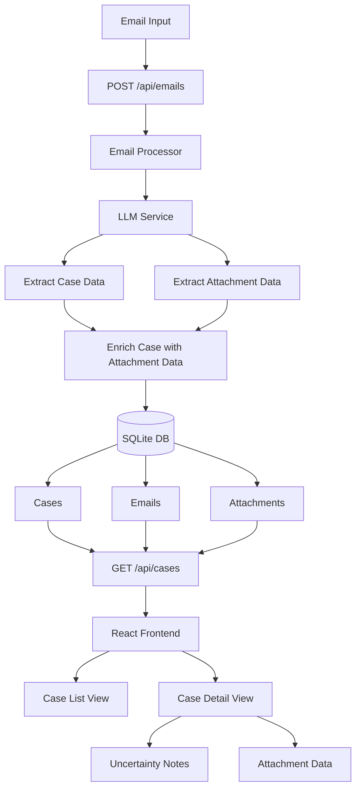

# Triage: Automated IME Email Processing System

A backend service that processes inbound emails for Independent Medical Examination (IME) companies, uses LLM to extract structured case data, and provides a clean React UI for viewing cases and attachments.

## Overview

Triage simulates a real-world email processing system for IME companies. It:

- **Processes inbound emails** via HTTP endpoint (simulated ingestion)
- **Extracts structured data** using OpenAI GPT-4 (patient name, case number, exam dates, etc.)
- **Categorizes attachments** (Medical Records, Declarations, Cover Letters, Other)
- **Persists data** to SQLite database with normalized schema
- **Provides a React UI** for viewing and searching cases

## Architecture

```
Email Source → Email Ingestion → LLM Extraction → Database → React UI
```

### Data Flow Diagram



### Technology Stack

- **Backend**: Node.js + Express + TypeScript
- **LLM**: OpenAI GPT-4 Turbo (configurable)
- **Database**: SQLite (zero-config, file-based)
- **Frontend**: React + TypeScript + Vite
- **Email Ingestion**: Simulated HTTP endpoint (Option B)

## Project Structure

```
Triage/
├── backend/
│   ├── src/
│   │   ├── server.ts              # Express server
│   │   ├── routes/
│   │   │   ├── email.ts           # Email ingestion endpoint
│   │   │   └── cases.ts           # Case query endpoints
│   │   ├── services/
│   │   │   ├── emailProcessor.ts  # Email parsing & LLM extraction
│   │   │   └── llmService.ts      # OpenAI integration
│   │   ├── models/
│   │   │   ├── database.ts        # SQLite setup & migrations
│   │   │   └── schemas.ts         # TypeScript types
│   │   └── utils/
│   │       ├── emailCreator.ts    # Generate sample emails (clean/messy/etc.)
│   │       └── sendCreatedEmail.ts# Send generated emails to the API
│   ├── package.json
│   └── tsconfig.json
├── frontend/
│   ├── src/
│   │   ├── App.tsx
│   │   ├── components/
│   │   │   ├── CaseList.tsx       # List of all cases
│   │   │   ├── CaseDetail.tsx     # Case details view
│   │   │   └── AttachmentList.tsx # Attachment display
│   │   └── services/
│   │       └── api.ts             # API client
│   ├── package.json
│   └── vite.config.ts
└── README.md
```

## Database Schema

The system uses SQLite with three normalized tables:

### `cases` Table
- `id` (PK) - Auto-incrementing integer
- `patient_name` - TEXT, nullable
- `case_number` - TEXT, nullable
- `exam_date` - TEXT (ISO date), nullable
- `exam_type` - TEXT, nullable
- `referring_party` - TEXT, nullable
- `location` - TEXT, nullable
- `created_at` - TEXT (ISO datetime)
- `updated_at` - TEXT (ISO datetime)

### `emails` Table
- `id` (PK) - Auto-incrementing integer
- `case_id` (FK) - References cases.id
- `subject` - TEXT
- `sender` - TEXT
- `recipients` - TEXT (JSON array as string)
- `body` - TEXT
- `received_at` - TEXT (ISO datetime)

### `attachments` Table
- `id` (PK) - Auto-incrementing integer
- `case_id` (FK) - References cases.id
- `filename` - TEXT
- `category` - TEXT (Medical Records, Declarations, Cover Letters, Other)
- `content_preview` - TEXT, nullable (first 500 chars)
- `created_at` - TEXT (ISO datetime)

**Normalization Strategy:**
- Cases are the primary entity
- Emails and attachments reference cases (one-to-many)
- Intentional denormalization: Extracted fields stored in `cases` for fast querying
- Foreign keys with CASCADE delete for data integrity

## Setup Instructions

### Prerequisites

- Node.js 18+ and npm
- OpenAI API key ([get one here](https://platform.openai.com/api-keys))

### 1. Clone and Navigate

```bash
git clone https://github.com/danhsiao/Triage.git
cd Triage
```

### 2. Backend Setup

```bash
cd backend
npm install
```

Create a `.env` file in the `backend/` directory:

```bash
cp .env.example .env
```

Edit `.env` and add your OpenAI API key:

```env
OPENAI_API_KEY=your_openai_api_key_here
OPENAI_MODEL=gpt-4-turbo-preview
PORT=3001
```

### 3. Frontend Setup

```bash
cd ../frontend
npm install
```

### 4. Initialize Database

The database is automatically created on first server start, but you can manually initialize it:

```bash
cd ../backend
npm run db:migrate
```

## Running the Project

### Development Mode

**Terminal 1 - Backend:**
```bash
cd backend
npm run dev
```

The backend will start on `http://localhost:3001`

**Terminal 2 - Frontend:**
```bash
cd frontend
npm run dev
```

The frontend will start on `http://localhost:3000`

**Terminal 3 - Send sample emails (choose a style):**
```bash
cd backend
npm run send:email clean
# or: npm run send:email messy
# or: npm run send:email structured
# or: npm run send:email unstructured
```

### Production Mode

**Build Backend (optional for production-style run):**
```bash
cd backend
npm run build
npm start
```

**Build Frontend (optional for production-style run):**
```bash
cd frontend
npm run build
npm run preview
```

> In development you do **not** need `npm run build`/`npm start`; use the three terminals above. Build/start only when you want a production-style run.

## Simulating Email Ingestion

### Manual API Call (optional)

```bash
curl -X POST http://localhost:3001/api/emails \
  -H "Content-Type: application/json" \
  -d '{
    "subject": "New IME Referral – John Doe – Case #NF-12345",
    "sender": "referrals@lawfirm.com",
    "recipients": ["triage@brighterway.ai"],
    "body": "Patient: John Doe\nCase Number: NF-12345\nExam Type: Orthopedic IME",
    "attachments": [
      {
        "filename": "records.pdf",
        "content": "Medical records content here..."
      }
    ]
  }'
```

### Email Creator Tool

Create and send sample emails with different styles:

```bash
cd backend

# List available styles
npm run create:email

# Create a clean, well-formatted email (outputs JSON)
npm run create:email clean

# Create a messy, unstructured email
npm run create:email messy

# Create a highly structured, formal email
npm run create:email structured

# Create an unstructured, minimal email
npm run create:email unstructured

# Send a created email directly to the API
npm run send:email clean
npm run send:email messy
```

**Available Styles:**
- `clean` - Well-formatted, professional email with complete information
- `messy` - Unstructured, informal email with uncertain information
- `structured` - Formal, highly structured email with detailed information
- `unstructured` - Very informal, minimal information, poorly organized

## API Endpoints

### `POST /api/emails`
Process an incoming email and extract case data.

**Request Body:**
```json
{
  "subject": "string",
  "sender": "string",
  "recipients": ["string"],
  "body": "string",
  "attachments": [
    {
      "filename": "string",
      "content": "string"
    }
  ]
}
```

**Response:**
```json
{
  "case": {
    "id": 1,
    "patientName": "John Doe",
    "caseNumber": "NF-12345",
    ...
  },
  "emails": [...],
  "attachments": [...]
}
```

### `GET /api/cases`
Get all cases with their emails and attachments.

**Response:**
```json
[
  {
    "case": {...},
    "emails": [...],
    "attachments": [...]
  }
]
```

### `GET /api/cases/:id`
Get a specific case by ID with all relations.

**Response:**
```json
{
  "case": {...},
  "emails": [...],
  "attachments": [...]
}
```

### `GET /health`
Health check endpoint.

## LLM Extraction

The system uses OpenAI GPT-4 Turbo to extract structured data from emails. The LLM is prompted to extract:

- **Patient Name**
- **Case Number**
- **IME / Exam Date** (converted to ISO format)
- **Exam Type** (e.g., Orthopedic IME, Neurology IME, Psych IME)
- **Referring Party / Law Firm**
- **Location** (if mentioned)
- **Attachment Categories**:
  - Medical Records
  - Declarations
  - Cover Letters
  - Other (with reason)

The LLM uses JSON mode for consistent, parseable output. If extraction fails, the system falls back to storing null values and categorizing attachments as "Other".

## Frontend Features

- **Case List View**: Browse all cases with search/filter functionality
- **Case Detail View**: View complete case information, emails, and attachments
- **Attachment Categorization**: Color-coded categories for easy identification
- **Responsive Design**: Clean, modern UI built with React

## Sample Emails

Use the email creator to generate realistic sample emails with attachments:

- `npm run create:email clean` (well-formatted, complete info)
- `npm run create:email messy` (uncertain language, informal)
- `npm run create:email structured` (formal, detailed)
- `npm run create:email unstructured` (minimal, poorly organized)

Send a generated email directly to the API:

```bash
cd backend
npm run send:email clean
npm run send:email messy
npm run send:email structured
npm run send:email unstructured
```

### Attachment Content

**Important**: The generated sample emails include detailed, realistic attachment content that demonstrates the extraction capabilities. The attachment content includes:
- Dates (treatment dates, injury dates, exam dates)
- Healthcare providers (names, addresses, phone numbers)
- Diagnoses and medical conditions
- Treatment history and medications
- Case-relevant information

**Creating Your Own Attachment Content**:
- You can modify `backend/src/utils/emailCreator.ts` to add your own attachment content
- For best extraction results, include:
  - Specific dates (e.g., "March 16, 2023", "April 2, 2025")
  - Provider names and contact information
  - Diagnoses or medical conditions
  - Treatment details and medications
  - Any case-specific information
- The LLM will extract structured data from this content and display it in the "Extracted Data" section

**Where Extracted Data Appears**:
- In the frontend, each attachment card shows an "Extracted Data" section (green box)
- This displays:
  - **Key Dates**: All dates found in the attachment
  - **Healthcare Providers**: Names and facilities mentioned
  - **Diagnoses**: Medical conditions identified
  - **Treatment History**: Summary of treatments
  - **Case-Relevant Info**: Other important information

If the "Extracted Data" section is empty, it means the attachment content didn't contain extractable structured information (dates, providers, diagnoses, etc.).

## Environment Variables

### Backend (.env)

| Variable | Description | Default |
|----------|-------------|---------|
| `OPENAI_API_KEY` | Your OpenAI API key (required) | - |
| `OPENAI_MODEL` | OpenAI model to use | `gpt-4-turbo-preview` |
| `PORT` | Backend server port | `3001` |
| `API_URL` | API URL used by send:email/emailCreator scripts | `http://localhost:3001` |

## Design Decisions

This section documents the key architectural and design choices made during development, along with the reasoning behind each decision.

### Email Ingestion Approach

**Choice**: Simulated HTTP endpoint (Option B) instead of real email integration

**Reasoning**:
- **Prototype Simplicity**: No need to configure email providers (Gmail, Outlook), OAuth, or webhooks
- **Rapid Development**: Focus on core functionality (LLM extraction, data processing) rather than email infrastructure
- **Easy Testing**: Can easily test with sample emails without sending real emails
- **Production Ready**: The HTTP endpoint can easily be adapted to receive emails from real providers via webhooks or polling

### Database Choice

**Choice**: SQLite instead of PostgreSQL or MongoDB

**Reasoning**:
- **Zero Configuration**: No database server setup required - perfect for a prototype
- **File-Based**: Single file database makes backup and deployment simple
- **Full SQL Support**: Supports complex queries, joins, and transactions
- **Easy Migration**: Can migrate to PostgreSQL later with minimal code changes (both use SQL)
- **Performance**: More than sufficient for prototype workloads
- **Schema Clarity**: Explicit schema with foreign keys ensures data integrity

### LLM Provider

**Choice**: OpenAI GPT-4 Turbo instead of Anthropic Claude or local models

**Reasoning**:
- **JSON Mode**: Native support for structured JSON output ensures reliable parsing
- **Proven Reliability**: Most mature API with excellent documentation
- **Consistent Results**: Low temperature (0.1) provides consistent extraction
- **Token Efficiency**: Efficient handling of long email bodies and attachments
- **Future Flexibility**: Easy to switch models or add fallback providers

### Attachment Categorization

**Choice**: Three primary categories (Medical Records, Declarations, Cover Letters) + "Other" fallback

**Reasoning**:
- **Covers 95% of Use Cases**: These three categories cover the vast majority of IME email attachments
- **Graceful Degradation**: "Other" category handles edge cases without failing
- **LLM Guidance**: Enhanced prompts with filename pattern recognition improve accuracy
- **User-Friendly**: Clear, intuitive categories that match industry terminology
- **Extensibility**: Can add more categories later if needed

### Uncertainty Handling

**Choice**: LLM-generated notes explaining uncertainty instead of numeric confidence scores

**Reasoning**:
- **Human-Readable**: Notes like "Case number might be RH-99102 or something close" are more actionable than "confidence: 0.65"
- **Contextual**: LLM can explain WHY something is uncertain (e.g., "email says 'might be'")
- **Reviewer-Friendly**: Human reviewers can quickly understand and act on uncertainty notes
- **Flexible**: Can include alternative values and reasoning in natural language
- **Better UX**: Frontend can display uncertainty warnings with explanations

### Case Deduplication Strategy

**Choice**: Create new cases for each email instead of linking to existing cases

**Reasoning**:
- **Simplicity**: Avoids complex matching heuristics (patient name variations, case number formats)
- **No False Positives**: Prevents incorrectly linking unrelated cases
- **Clear Data Model**: Each email creates a distinct case record
- **Future Enhancement**: Can add case linking logic later if needed (e.g., match by case number + patient name)
- **Prototype Scope**: Keeps initial implementation focused on core extraction functionality

### Attachment Data Extraction

**Choice**: Structured data extraction from attachments instead of storing full content

**Reasoning**:
- **Efficiency**: Extracts actionable data (dates, providers, diagnoses) without storing entire documents
- **Token Optimization**: Only processes relevant information, reducing LLM costs
- **Data Enrichment**: Extracted data can fill gaps in email extraction (e.g., exam date from medical records)
- **Searchability**: Structured data enables better querying and filtering
- **Privacy**: Stores summaries rather than full medical records
- **Scalability**: More efficient than storing full attachment content in database

### Technology Stack

**Backend: Node.js + Express + TypeScript**
- **Node.js**: Excellent ecosystem for API development, async processing
- **Express**: Simple, well-documented web framework
- **TypeScript**: Type safety catches errors early, improves maintainability

**Frontend: React + TypeScript + Vite**
- **React**: Component-based UI, excellent ecosystem
- **TypeScript**: Shared types with backend, type safety
- **Vite**: Fast development server, modern build tooling

**Database: SQLite with better-sqlite3**
- **better-sqlite3**: Synchronous API simplifies transaction handling
- **No ORM**: Direct SQL provides full control and clarity

### Error Handling Strategy

**Choice**: Graceful fallbacks with null values instead of failing completely

**Reasoning**:
- **Resilience**: System continues processing even if LLM fails
- **Partial Success**: Can still store email and attachments even if extraction fails
- **User Visibility**: Frontend shows "N/A" for missing data, prompting manual review
- **Logging**: Comprehensive error logging helps diagnose issues
- **Recovery**: Failed extractions can be reprocessed later

### Architecture Patterns

**Separation of Concerns**:
- **Services Layer**: `llmService.ts` handles all LLM interactions
- **Processing Layer**: `emailProcessor.ts` orchestrates extraction and storage
- **Data Layer**: `database.ts` handles all database operations
- **Routes Layer**: Thin controllers that delegate to services

**Transaction Safety**: All database writes use transactions to ensure data consistency

**Lazy Loading**: OpenAI client initialized only when needed, after environment variables are loaded

## Troubleshooting

### Backend won't start
- Check that port 3001 is available
- Verify `.env` file exists and contains `OPENAI_API_KEY`
- Ensure Node.js 18+ is installed

### LLM extraction fails
- Verify OpenAI API key is valid and has credits
- Check API rate limits
- Review console logs for specific error messages

### Database errors
- Delete `backend/data/triage.db` to reset database
- Run `npm run db:migrate` to reinitialize

### Frontend can't connect to backend
- Ensure backend is running on port 3001
- Check CORS settings (should be enabled)
- Verify proxy configuration in `vite.config.ts`

## Future Enhancements

Potential improvements for production:

- Real email integration (Gmail, Outlook APIs)
- Authentication and authorization
- OCR for PDF/image attachments
- Email webhook support
- Advanced search and filtering
- Export functionality
- Email templates and notifications
- Multi-tenant support
- Audit logging

## License

ISC

## Contact

For questions about this project, contact: jason@brighterway.ai

